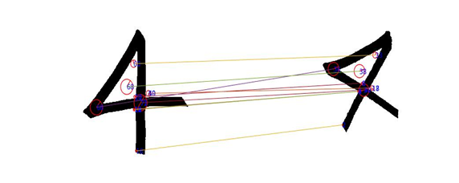

# Digit Recognition using SIFT (Scale Invariant Feature Transform) in Matlab

* The scale-invariant feature transform (SIFT) is a feature detection algorithm in computer vision to detect and describe local features in images.
* In this project, we use SIFT to detect the similar features between two numbers to determine what number it is.
* This project provides a GUI upon running where you can draw an arbitrary number and the program will output the top 3 most likely numbers it thinks the number is.
* To use: run the **gui_test2.m** file.
* For the details of implementation: run **with_scoring.m**.
* A quick look at how SIFT works:

